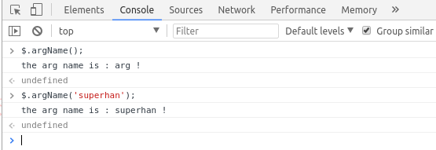
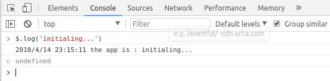
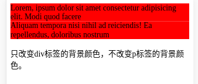
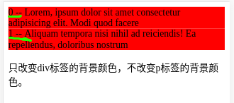
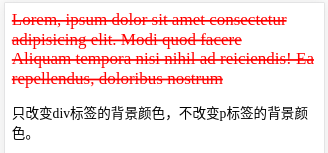
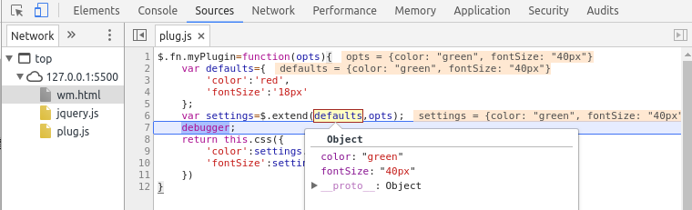
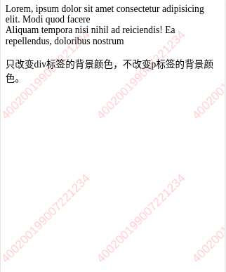

# jQuery 插件的开发模式

# 插件开发

根据《jQuery高级编程》的描述，jQuery插件开发方式主要有三种：

`$.extend()`来扩展jQuery
`$.fn` 向jQuery添加新的方法
`$.widget()`应用jQuery UI的部件工厂方式创建
## 基本方法
1. `$.extend({})` 方法
```js
$.extend({
    argName:function(arg){
        console.log('the arg name is : ' +(arg ? arg : 'arg')+' !');
    }
})
$.argName(); // 不传参数，直接调用
$.argName('Superhan'); // 带入参数的调用

```


* 上面代码中，通过`$.extend()`向jQuery添加了一个argName 函数，然后通过$直接调用。到此可以认为我们已经完成了一个简单的jQuery插件了

* 比如定义一个打印日志的函数
```js
$.extend({
    log: function(message) {
        var now = new Date(),
            y = now.getFullYear(),
            m = now.getMonth() + 1, 
            d = now.getDate(),
            h = now.getHours(),
            min = now.getMinutes(),
            s = now.getSeconds(),
            time = y + '/' + m + '/' + d + ' ' + h + ':' + min + ':' + s;
        console.log(time + ' the app is : ' + message);
    }
})
$.log('initializing...'); //调用
```


* 但这种方式无法利用jQuery强大的选择器带来的便利，要处理DOM元素以及将插件更好地运用于所选择的元素身上，还是需要使用第二种开发方式。


2. `$.fn` 方法
基本的格式：
```js
$.fn.pluginName=function(){
    // the code 
}

```

就是往$.fn上面添加一个方法，名字是插件名称。插件代码写在这个方法里面。比如我们将页面上所有div的背景颜色转成红色，则可以这样写这个插件：
```js
$.fn.myPlugin=function(){
    // 此处的this 指的是jQuery选中的元素
    // eg.如    $('div), 则 this=$('div')
    this.css('backgroundColor','red');
}

```
**此处特别注意：** 在插件名字定义的函数内部，this指的是调用该插件时，jQuery选择器选中的元素，是一个jQuery类型的集合。对其进行操作的时候可以直接调用jQuery的其他方法，而不需要再用美元符号来包装一下。

```html
<body>
<div>Lorem, ipsum dolor sit amet consectetur adipisicing elit. Modi quod facere </div>
<div> Aliquam tempora nisi nihil ad reiciendis! Ea repellendus, doloribus nostrum</div>
<p>只改变div标签的背景颜色，不改变p标签的背景颜色。</p>
<script src='./jquery.js'></script>
<script src="./jquery.myplugin.js"></script>
<script>
    $(function(){
        $('div').myPlugin();
    })
   
</script>
</body>
```




当然，我们也可以对插件代码里每个具体的元素进行处理，而不是一个集合。通过jQuery的.each()方法可以处理集合中的每个元素。但需要注意的是，在each方法内部，this指的是普通的DOM元素，如果需要用jQuery的方法就需要用`$`重新包装一下。

比如对刚才选中的div内的文字添加序列号。
```js
$.fn.myPlugin=function(){
    // 此处的this 指的是jQuery选中的元素
    // eg.如    $('div), 则 this=$('div')
    this.css('backgroundColor','red');
    this.each(function(index,ele){
        // 对每个元素进行处理
        var txt=$(this).text();
        $(this).empty().append(index + ' -- '+ txt);
    })
}


```




## 支持链式调用

jQuery 选择好DOM元素后，可以不断地调用其他方法。要实现链式调用，只需要return 一下就可以。

```js
$.fn.myPlugin=function(){
    // 此处的this 指的是jQuery选中的元素
    // eg.如    $('div), 则 this=$('div')
    return this.css('backgroundColor','red');
    
}

```


## 插件接收参数
好的插件是可以让使用者随意定制的，这就要求我们编写插件时就要考虑得全面些，尽量提供合适的参数。 
在处理插件参数的接收上，通常使用jQuery的extend方法，但那是给extend方法传递单个对象的情况下，这个对象会合并到jQuery身上，所以我们就可以在jQuery身上调用新合并对象里包含的方法了。当给extend方法传递一个以上的参数时，它会将所有参数对象合并到第一个里。同时，如果对象中有同名属性时，合并的时候后面的会覆盖前面的。

```js
$.fn.myPlugin = function(opts) {
    var defaults = {
        'color': 'red',
        'fontSize': '20px',
        'textDecoration':'line-through'
    };
    var settings = $.extend(defaults, opts);
    return this.css({
        'color': settings.color,
        'fontSize': settings.fontSize,
        'textDecoration':settings.textDecoration
    });
}
```

## 保护默认参数
注意到上面代码调用extend时会将defaults的值改变，这样不好，因为作为插件应该有的一些东西应该维持原样，另外就是如果你在后续代码中还要使用这些默认值的话，当你再次访问它时它已经被用户传进来的参数更改了。

  

更好的做法是将一个新的空对象做为$.extend的第一个参数，defaults和用户传递的参数对象紧随其后，这样做的好处是所有值被合并到这个空对象上，保护了插件里面的默认值。

```js
$.fn.myPlugin = function(options) {
    var defaults = {
        'color': 'red',
        'fontSize': '12px'
    };
    var settings = $.extend({},defaults, options);//将一个空对象做为第一个参数
    return this.css({
        'color': settings.color,
        'fontSize': settings.fontSize
    });
}

```
## 面向对象开发插件
如果将需要的重要变量定义到对象的属性上，函数变成对象的方法，当我们需要的时候通过对象来获取，一来方便管理，二来不会影响外部命名空间，因为所有这些变量名还有方法名都是在对象内部。

下面将以前写的添加数字水印的功能改成插件的方式。
```js
 // 定义WATERMARK构造函数
    var WATERMARK = function (el, opt) {
        this.$element = el,
        //默认属性配置
        this.defaults = {
            'width': 160,
            'height': 240,
            'color': 'red',
            'alpha': .2,
            'font': '20px Arial',
            'text': '400200199007221234'
        },
        // 将自定义属性和默认属性合并到一个空对象参数上
        this.options = $.extend({}, this.defaults, opt)
    }
    // 定义WATERMARKD的方法
    WATERMARK.prototype = {
        _watermark: function () {
            var canvas = document.createElement('canvas');
            var ctx = canvas.getContext('2d');
            canvas.width = this.options.width;
            canvas.height = this.options.height;
            ctx.clearRect(0, 0, canvas.width, canvas.height);
            ctx.globalAlpha = this.options.alpha;
            ctx.font = this.options.font;
            ctx.textAlign = 'left';
            ctx.textBaseline = 'bottom';
            ctx.translate(canvas.width * .1, canvas.height * .9);
            ctx.rotate(-Math.PI / 4);
            ctx.fillStyle = this.options.color;
            ctx.fillText(this.options.text, 4, -10);
            return canvas.toDataURL();
        }
    }
    // 在插件中使用WATERMARK对象
    $.fn.watermark = function (options) {
        //创建一个WATERMARK的实例
        var wm = new WATERMARK(this, options);
        //调用其方法
        return this.css({'background':'url(' + wm._watermark() + ')'});
    }

```
面向对象的方式处理后，更好维护和理解了，以后要加新功能新方法，只需向对象添加新变量及方法即可，然后在插件里实例化后即可调用新添加的东西。


# 命名空间
不仅仅是jQuery插件的开发，我们在写任何JS代码时都应该注意的一点是不要污染全局命名空间。因为随着你代码的增多，如果有意无意在全局范围内定义一些变量的话，最后很难维护，也容易跟别人写的代码有冲突。

比如你在代码中向全局window对象添加了一个变量status用于存放状态，同时页面中引用了另一个别人写的库，也向全局添加了这样一个同名变量，最后的结果肯定不是你想要的。所以不到万不得已，一般我们不会将变量定义成全局的。

一个好的做法是始终用自调用匿名函数包裹你的代码，这样就可以完全放心，安全地将它用于任何地方了，绝对没有冲突。

## 用自调用匿名函数包裹代码
我们知道JavaScript中无法用花括号方便地创建作用域，但函数却可以形成一个作用域，域内的代码是无法被外界访问的。如果我们将自己的代码放入一个函数中，那么就不会污染全局命名空间，同时不会和别的代码冲突。
```js
(function () {
    // 定义WATERMARK构造函数
    var WATERMARK = function (el, opt) {
        this.$element = el,
        //默认属性配置
        this.defaults = {
            'width': 160,
            'height': 240,
            'color': 'red',
            'alpha': .2,
            'font': '20px Arial',
            'text': '400200199007221234'
        },
        // 将自定义属性和默认属性合并到一个空对象参数上
        this.options = $.extend({}, this.defaults, opt)
    }
    // 定义WATERMARKD的方法
    WATERMARK.prototype = {
        _watermark: function () {
            var canvas = document.createElement('canvas');
            var ctx = canvas.getContext('2d');
            canvas.width = this.options.width;
            canvas.height = this.options.height;
            ctx.clearRect(0, 0, canvas.width, canvas.height);
            ctx.globalAlpha = this.options.alpha;
            ctx.font = this.options.font;
            ctx.textAlign = 'left';
            ctx.textBaseline = 'bottom';
            ctx.translate(canvas.width * .1, canvas.height * .9);
            ctx.rotate(-Math.PI / 4);
            ctx.fillStyle = this.options.color;
            ctx.fillText(this.options.text, 4, -10);
            return canvas.toDataURL();
        }
    }
    // 在插件中使用WATERMARK对象
    $.fn.watermark = function (options) {
        //创建一个WATERMARK的实例
        var wm = new WATERMARK(this, options);
        //调用其方法
        return this.css({'background':'url(' + wm._watermark() + ')'});
    }
})()
```
这样做不仅可以不污染全局命名空间，同时不会与别的代码冲突，而且自调用匿名函数里面的代码会在第一时间执行，页面准备好过后，上面的代码就将插件准备好了，方便在后面的代码中使用插件。

如果再考虑到其他一些因素，比如我们将这段代码放到页面后，前面别人写的代码没有用分号结尾，或者前面的代码将window, undefined等这些系统变量或者关键字修改掉了，正好我们又在自己的代码里面进行了使用，那结果也是不可预测的，这不是我们想要的。

## 将系统变量传递进插件内部

window等系统变量在插件内部就有了一个局部的引用，可以提高访问速度，会有些许性能的提升

最后我们得到一个非常安全结构良好的代码：
```js
;(function($,window,document,undefined){
    //我们的代码。。
})(jQuery,window,document);

```
关于这个`undefined` 。我们为了得到没有被修改的`undefined`，并没有传递这个参数，但却在接收时接收了它，因为实际并没有传，所以`undefined`那个位置接收到的就是真实的`undefined`了

```js
/** 
 * javascript 
 * @Author: superhan
 * @Date: 2018-04-12 010:54:22 
 * @Desc:  waterMark is a jquery plugin , used for generate digit mark .
 */

; (function ($, window, document, undefined) {
    // 定义WATERMARK构造函数
    var WATERMARK = function (el, opt) {
        this.$element = el,
        //默认属性配置
        this.defaults = {
            'width': 160,
            'height': 240,
            'color': 'red',
            'alpha': .2,
            'font': '20px Arial',
            'text': '400200199007221234'
        },
        // 将自定义属性和默认属性合并到一个空对象参数上
        this.options = $.extend({}, this.defaults, opt)
    }
    // 定义WATERMARKD的方法
    WATERMARK.prototype = {
        _watermark: function () {
            var canvas = document.createElement('canvas');
            var ctx = canvas.getContext('2d');
            canvas.width = this.options.width;
            canvas.height = this.options.height;
            ctx.clearRect(0, 0, canvas.width, canvas.height);
            ctx.globalAlpha = this.options.alpha;
            ctx.font = this.options.font;
            ctx.textAlign = 'left';
            ctx.textBaseline = 'bottom';
            ctx.translate(canvas.width * .1, canvas.height * .9);
            ctx.rotate(-Math.PI / 4);
            ctx.fillStyle = this.options.color;
            ctx.fillText(this.options.text, 4, -10);
            return canvas.toDataURL();
        }
    }
    // 在插件中使用WATERMARK对象
    $.fn.watermark = function (options) {
        //创建一个WATERMARK的实例
        var wm = new WATERMARK(this, options);
        //调用其方法
        return this.css({'background':'url(' + wm._watermark() + ')'});
    }

})(jQuery, window, document)
```
# 变量定义&命名
关于变量及方法等的命名，没有硬性规定，但为了规范，遵循一些约定还是很有必要的。

**变量定义：** 好的做法是把将要使用的变量名用一个var关键字一并定义在代码开头，变量名间用逗号隔开。原因有二：

    * 一是便于理解，知道下面的代码会用到哪些变量，同时代码显得整洁且有规律，也方便管理，变量定义与逻辑代码分开；

    * 二是因为JavaScript中所有变量及函数名会自动提升，即使你将变量的定义穿插在逻辑代码中，在代码解析运行期间，
    这些变量的声明还是被提升到了当前作用域最顶端的，所以我们将变量定义在一个作用域的开头是更符合逻辑的一种做法。
    当然，再次说明这只是一种约定，不是必需的。
   
**变量及函数命名** 一般使用驼峰命名法（CamelCase），即首个单词的首字母小写，后面单词首字母大写，比如`isArray`，`requestAnimationFrame`。对于常量，所有字母采用大写,如 `PI`，多个单词用下划线隔开，`TITLE_COLOR='#00ff00'`。当变量是`jQuery`类型时，建议以`$`开头，开始会不习惯，但经常用了之后会感觉很方便，因为可以很方便地将它与普通变量区别开来，一看到以$开头我们就知道它是`jQuery`类型可以直接在其身上调用`jQuery`相关的方法，比如`var $element=$('p')`。
                
**引号的使用:** 一般HTML代码里面使用双引号，而在JavaScript中多用单引号。一方面，HTML代码中本来就使用的是双引号，另一方面，在JavaScript中引号中还需要引号的时候，要求我们单双引号间隔着写才是合法的语句

# 代码混淆&压缩

## 压缩的好处


# 插件发布

